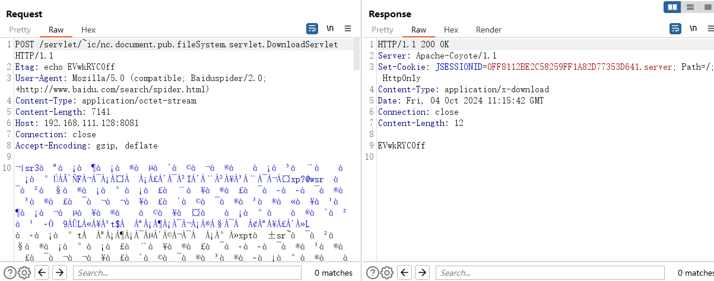
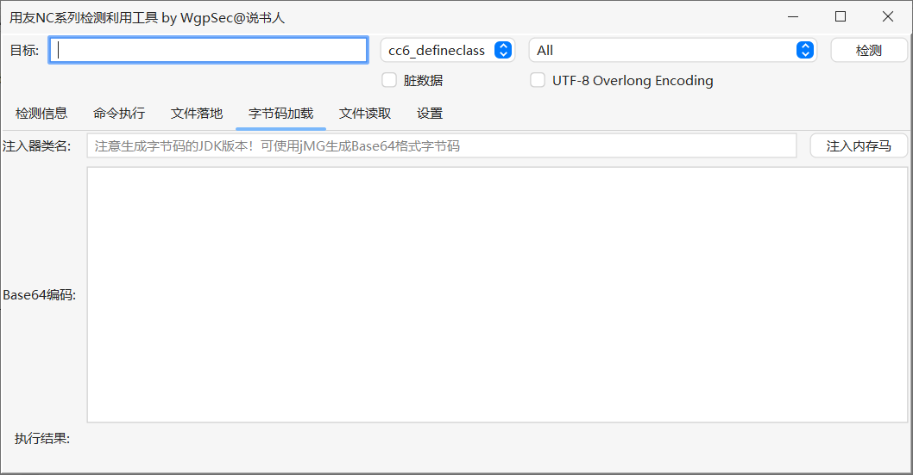
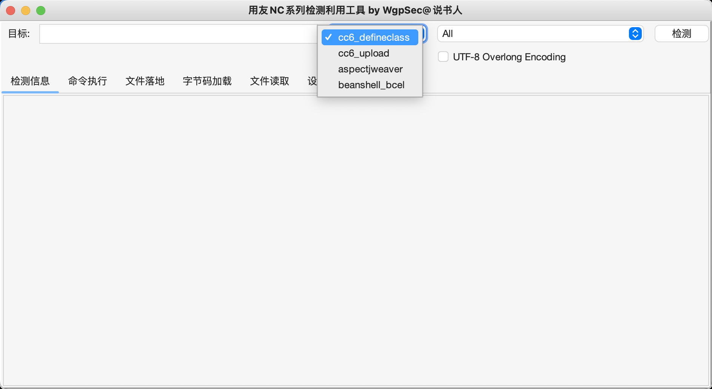

#  Yongyou-Unserialize-plus
2023年分析用友的一些反序列化链子以及1day，二开了一下工具

绕waf：
[https://mp.weixin.qq.com/s/fcuKNfLXiFxWrIYQPq7OCg](https://mp.weixin.qq.com/s/fcuKNfLXiFxWrIYQPq7OCg)
[https://vidar-team.feishu.cn/docx/LJN4dzu1QoEHt4x3SQncYagpnGd](https://vidar-team.feishu.cn/docx/LJN4dzu1QoEHt4x3SQncYagpnGd)
套一下Whoopsunix师傅写的 https://github.com/Whoopsunix/utf-8-overlong-encoding/blob/main/src/main/java/com/ppp/UTF8OverlongObjectOutputStream.java 就可以了

# 用友nc反序列化利用工具

YongYouNc.jar

二开的：https://github.com/wgpsec/YongYouNcTool
jdk1.8启动

1. 增加脏数据以及UTF-8 Overlong Encoding

   

2. 将内存马改为字节码加载，方便加载自定义的字节码

   

   使用JMG生成tomcat内存马即可

3. 增加反序列化利用链，以及多个poc

   支持漏洞：

   ```
   BshServlet rce
   jsInvoke rce
   DeleteServlet 反序列化
   DownloadServlet 反序列化
   FileReceiveServlet 反序列化
   FileReceiveServlet 文件上传
   DownloadServlet 反序列化
   MonitorServlet 反序列化
   MxServlet 反序列化
   monitorservlet 反序列化
   UploadServlet 反序列化
   NCMessageServlet 反序列化
   JiuQiClientReqDispatch 反序列化
   FileParserServlet 反序列化
   FileUploadServlet 反序列化
   DcUpdateRESTService 反序列化
   ECFileManageServlet 反序列化
   OAContactsFuzzySearchServlet 反序列化
   LoggingConfigServlet 反序列化
   ConfigResourceServlet 反序列化
   ModelHandleServlet 反序列化
   ContactsQueryServiceServlet 反序列化
   ContactsFuzzySearchServlet 反序列化
   UserQueryServiceServlet 反序列化
   UserSynchronizationServlet 反序列化
   UserAuthenticationServlet 反序列化
   ResourceManagerServlet 反序列化
   XbrlPersistenceServlet 反序列化
   NCFindWeb 文件读取/列目录
   ```

   

另外推荐一个工具：[YONYOU-TOOL](https://github.com/Chave0v0/YONYOU-TOOL/)，很实用
